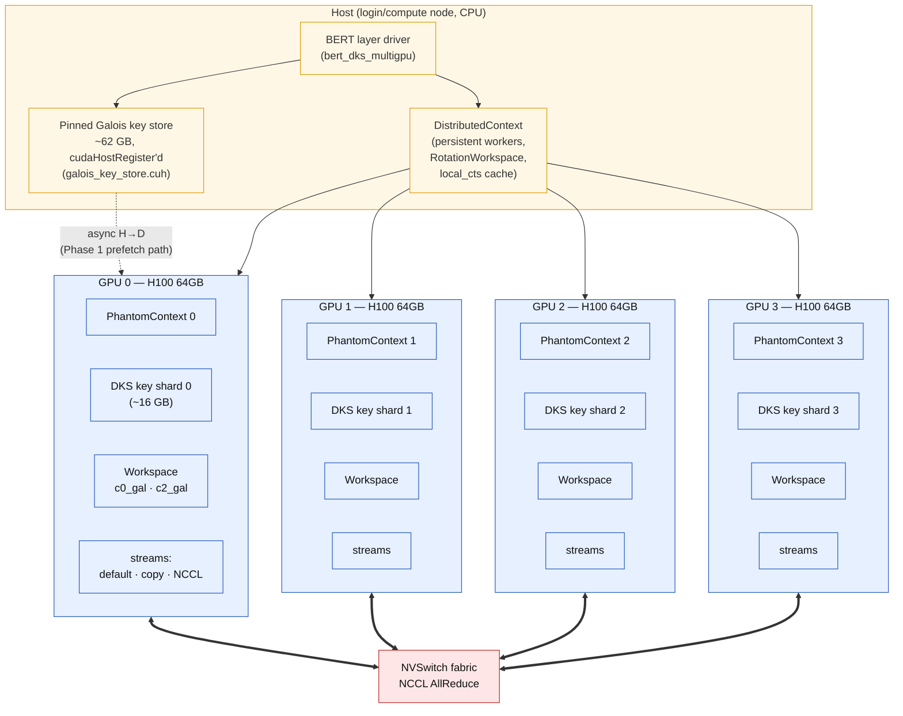
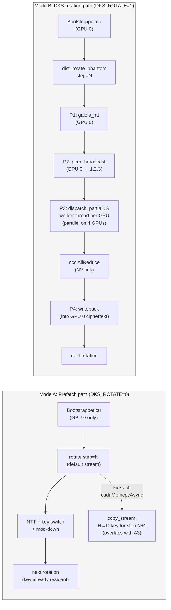

# multiNEXUS — State Briefing

**Audience:** PI walkthrough, ~15 minutes. Reads top-to-bottom; diagrams in the
middle, profiling recipe at the end.

---

## 1. One-paragraph status

multiNEXUS runs encrypted BERT-base inference under CKKS at ring dimension N=65536
across 4× H100 GPUs in a single MareNostrum 5 node, on top of the Phantom FHE
library. The hard constraint is that a full set of bootstrap Galois keys totals
~64 GB and does not fit on one H100; we shard keys 4-way across GPUs (DKS) and
keep them pinned on the host so unsharded streaming paths can still prefetch.
The current champion delivers a **2.16× end-to-end speedup over a CPU-streaming
baseline** (12-head BERT layer projected: 115.7 s vs 249.6 s) at correctness
parity (MAE 2.25e-6, well under the 1e-2 threshold). The remaining headroom is
in the bootstrap path itself, where NTT and NCCL straggler wait dominate per
the Nsight Systems traces.

## 2. Headline numbers

| Configuration | Bootstrap/call | 1-head layer | 12-head BERT | vs CPU |
|---|---|---|---|---|
| CPU streaming (baseline) | — | — | 249.6 s | 1.00× |
| Phase 0 — DKS storage only | 10,514 ms | 46,278 ms | 555.3 s | 0.45× ❌ |
| Phase 1 — async key prefetch + pinned host | 2,277 ms | 10,234 ms | 122.8 s | 2.03× |
| Phase 3 v2 — DKS rotation + persistent peer buffers | 2,143 ms | 9,741 ms | 116.9 s | 2.14× |
| Phase 4a — persistent local ciphertexts | 2,136 ms | 9,680 ms | 116.2 s | 2.15× |
| **Phase 4b — persistent worker threads (current)** | **2,126 ms** | **9,640 ms** | **115.7 s** | **2.16×** |

Reality check on each phase came from an Nsight Systems trace, not a printf
timer — see §6.

## 3. System diagram

### 3a. Component view (what's on each box, what links them)



### 3b. One bootstrap call — two compute modes side by side



**Reading these together:**
- The prefetch path keeps all *compute* on GPU 0 and uses GPUs 1-3 only as
  storage. It wins by hiding the H→D cost behind compute on the default stream.
- The DKS rotation path actually distributes compute across 4 GPUs but pays
  for it in NCCL AllReduce (currently ~291 ms of kernel + ~2 s of straggler
  wait per bootstrap, see traces).

### 3c. Where the 2.1 s/bootstrap goes (Phase 4b, from nsys)

```
[ NTT kernels                                                  ] 40%
[ partial_key_switch_inner_prod (across all 4 GPUs)            ] 6.7%
[ ncclAllReduce kernel                                         ] 14%
[ launch jitter / straggler wait inside AllReduce wall         ] ~25%
[ everything else (mod-up/down, rescale, BSGS scalars, etc.)   ] ~14%
```

The PI-relevant point: NTT is the biggest single component, it currently runs
*redundantly on all 4 GPUs*, and the deferred Phase 4c work (per-digit modup)
would shard it 4-way for a projected ~1.3 s/bootstrap (≈4× over baseline).

---

## 4. What "profiling" means here

Three different tools answer three different questions. We currently use the
first one in production; the other two we can stand up on demand.

| Tool | Question it answers | Granularity | Status here |
|---|---|---|---|
| **Nsight Systems (`nsys`)** | "What's running when, on which stream, with what overlap?" | µs, whole timeline | ✅ Wired up via NVTX |
| **Nsight Compute (`ncu`)** | "Why is *this kernel* slow? Memory-bound? Occupancy? Register-bound?" | per-kernel, per-warp | ⏳ Not yet used |
| **DCGM / nvidia-smi dmon** | "What did SM utilisation, memory bandwidth, power, thermals look like across the run?" | second-scale, system-wide | ⏳ Not yet used |

## 5. NVTX instrumentation already in the code

The binaries are compiled with NVTX ranges so the nsys timeline is annotated
with FHE-meaningful names (not just kernel symbols). The header is
[src/util/nvtx_tracer.cuh](../src/util/nvtx_tracer.cuh).

Ranges in the timeline (defined in [TRACING.md](../TRACING.md)):

| Range | What it bounds |
|---|---|
| `bootstrap_sparse_3` | One full bootstrap call |
| `coefftoslot_3`, `slottocoeff_full_3` | The two big sub-phases of bootstrap |
| `sfl_full_3`, `sflinv_full_3` | Linear-transform stages (75 rotations live here) |
| `rotate_inplace step=N` | One rotation, single-GPU path |
| `dist_rotate_phantom step=N` | One rotation, distributed path |
| `P1_galois_ntt`, `P2_peer_broadcast`, `P3_dispatch_partialKS`, `P4_writeback` | Inner phases of distributed rotation |
| `partialKS gpu=G` | Per-GPU partial key-switch (visualises 4-way parallelism) |
| `prefetch step=N`, `ks_prefetch idx=K`, `ks_load idx=K` | Async key streaming (Mode A) |

Overhead is ~300 ns per push/pop with nsys attached, zero in builds defining
`NEXUS_NO_NVTX`.

## 6. How to capture an Nsight Systems trace (recipe)

The end-to-end loop, one shell window each.

### 6a. Run the traced job on MN5

```bash
ssh mn5-gpu
cd /gpfs/projects/etur02/hkanpak/Comp390Project

# Self-contained nsys command (skip if scripts/slurm_trace_nsys.sh exists):
salloc --qos=acc_debug --account=etur02 --gres=gpu:4 --time=00:30:00 bash -lc '
  module purge && module load cuda/12.8 nccl/2.24.3-1
  mkdir -p traces

  for MODE in 0 1; do
    DKS_ROTATE=$MODE \
    nsys profile \
      --trace=cuda,nvtx,osrt,nccl \
      --sample=cpu \
      --capture-range=nvtx --nvtx-capture=bootstrap_sparse_3 \
      --capture-range-end=stop-shutdown \
      --output=traces/trace_$( [ $MODE = 0 ] && echo prefetch || echo dksrot ) \
      --force-overwrite=true \
      ./build/bin/bert_dks_multigpu 4
  done
'
```

The `--capture-range=nvtx` clamp keeps the trace small (~50-200 MB) by only
recording during the bootstrap call we care about — without it you get
multi-GB files dominated by setup.

### 6b. Pull the traces locally

```bash
mkdir -p ~/nexus-traces
rsync -avz mn5-gpu:/gpfs/projects/etur02/hkanpak/Comp390Project/traces/*.nsys-rep \
  ~/nexus-traces/
```

### 6c. Open the GUI on the Mac

Install [Nsight Systems 2024.6+](https://developer.nvidia.com/nsight-systems),
then:

```bash
open -a "Nsight Systems" ~/nexus-traces/trace_dksrot.nsys-rep
```

### 6d. What to actually look for in the GUI

These are the four things worth showing the PI on the timeline:

1. **Async prefetch overlap** (`trace_prefetch.nsys-rep`). Zoom into one
   `rotate_inplace step=N`. The `copy_stream` H→D bar for key N+1 should start
   *while* the default-stream NTT for step N is still running. If the H→D bar
   appears strictly *after* the kernel, host pinning broke and we lost
   Phase 1's win.
2. **DKS rotation parallelism** (`trace_dksrot.nsys-rep`). Zoom into one
   `dist_rotate_phantom`. Four `partialKS gpu=0..3` ranges should be active
   on four different default streams *simultaneously*. If only one is busy,
   the worker dispatcher serialised.
3. **NCCL straggler tail.** Inspect AllReduce ops right after
   `P3_dispatch_partialKS`. The kernel itself is short (~3-4 ms). The
   surrounding wall time is straggler wait — that's the Phase 4d target.
4. **`cudaMalloc` pauses.** Filter the CUDA API row by `cudaMalloc`. Should
   appear ~zero times inside `bootstrap_sparse_3`. If they appear in the hot
   loop, a workspace regressed.

### 6e. Text-only summary (no GUI)

If the PI just wants the numbers without opening the GUI, the SLURM log already
prints these, but you can regenerate from a `.nsys-rep` file:

```bash
nsys stats --report nvtxsum,gpukernsum,cudaapisum,nccl_sum trace_dksrot.nsys-rep
```

Output is plain text, columns include `Time (%)`, `Total Time`, `Instances`,
`Avg`, `Min`, `Max`. Easy to paste into slides.

---

## 7. What else we can profile (and what each one would tell us)

Currently only nsys is in active use. The other tools answer questions nsys
can't, and would be straightforward to stand up:

### 7a. Nsight Compute (`ncu`) — per-kernel deep dive

**Question:** *Why* is the NTT kernel so slow? Is it memory-bandwidth-bound or
compute-bound? What's the achieved occupancy?

```bash
ncu --target-processes all \
    --set full \
    --kernel-name regex:".*ntt.*" \
    --launch-skip 100 --launch-count 5 \
    -o ntt_profile \
    ./build/bin/bert_dks_multigpu 4
```

This produces an `.ncu-rep` you open in the Nsight Compute GUI. Sections
shown: SOL (% of theoretical peak), memory chart, scheduler statistics,
register pressure, source-line attribution. **This is the right next step
before doing Phase 4c**, because Phase 4c assumes per-digit modup speedup
will be linear with shard count — `ncu` will tell us whether NTT is
arithmetic-bound (linear scaling holds) or DRAM-bandwidth-bound (it doesn't).

### 7b. NCCL bandwidth check

**Question:** Is our `ncclAllReduce` actually saturating NVLink, or are we
leaving bandwidth on the table?

```bash
NCCL_DEBUG=INFO NCCL_DEBUG_SUBSYS=COLL,P2P \
  ./build/bin/bert_dks_multigpu 4 2>&1 | grep -E "AllReduce|bw"
```

Or, for a clean reference, run the standalone `nccl-tests` `all_reduce_perf`
binary at the message size we use per rotation (~50 MB per AllReduce in the
DKS path). If `nccl-tests` reports e.g. 200 GB/s but our trace shows 80,
there's tuning to do (algo, channel count, buffer reuse).

### 7c. SM utilisation / power / thermals across the run

**Question:** Are all 4 GPUs actually busy throughout? Or do they idle
between rotations (which would explain the AllReduce straggler)?

```bash
# In a second terminal during the run:
nvidia-smi dmon -s pucvmet -d 1 -o DT > gpu_dmon.log
# Columns: SM%, MemBW%, GPU power, GPU temp, mem clock, sm clock, …
```

Plot SM% over time per GPU. A clean run shows 4 saturated GPUs in the
distributed phases. Dips visible per-GPU at AllReduce points are the
straggler.

### 7d. Memory residency

**Question:** Are we using the 64 GB HBM well? Is the DKS shard plus
ciphertexts plus workspace fitting comfortably or barely?

```bash
nvidia-smi --query-gpu=index,memory.used,memory.free --format=csv -l 1 > mem.log
```

Pre-Phase 1 the answer was "single H100 OOMed at 64 GB key store"; we expect
each GPU to sit around 18-22 GB now. Sudden growth signals a leak in the
workspace or a missed `release()`.

### 7e. Source-line CPU attribution

**Question:** Is host-side orchestration eating time we'd attribute to GPU
compute?

`nsys profile --sample=cpu --cpuctxsw=process-tree …` (already in the
recipe) populates a CPU sampling row that maps to source lines. Useful to
catch e.g. `std::vector` allocations on the dispatch path — exactly the
class of bug Phase 4b fixed (persistent worker threads instead of
spawn-per-call).

### 7f. CUDA Graph capture analysis

**Question:** Could we collapse the 75-rotation sequence into a captured
graph and amortise launch overhead?

`cuda-gdb` or simple instrumentation around `cudaStreamBeginCapture` /
`cudaStreamEndCapture` reveals which kernel sequences are graph-capturable.
This is a possible Phase 5+ direction if launch latency turns out to matter
after the NTT/AllReduce work.

---

## 8. What to leave the PI thinking about

The three live questions ([HANDOFF.md §13](HANDOFF.md)):

1. **Ship at 2.16×.** Defensible writeup, project complete. multiNEXUS.md
   already reflects this.
2. **Push to ~4× via Phase 4c (per-digit modup).** Modify Phantom internals to
   let each GPU NTT only its β/4 owned digits. 1-2 days of engineering with
   real Phantom-internals risk. Highest theoretical ceiling, but should be
   gated on an `ncu` profile of the NTT kernel first (§7a).
3. **Demonstrate scaling via Phase 4e (multi-node DKS).** Wire the existing
   `DistGaloisKeyStore::generate_multinode` into the Bootstrapper for an 8-GPU
   2-node demo. ~2 days, mostly integration work. No bootstrap speedup, but
   shows the architecture extends.

The cheap-and-low-risk option, **Phase 4d (NCCL straggler fix)**, is a few
hours of work in
[output_aggregation.cu](../src/multi_gpu/keyswitching/output_aggregation.cu) and
worth doing regardless of which of 1/2/3 we pick — it should reclaim
200-500 ms/bootstrap from launch jitter without touching algorithms.
