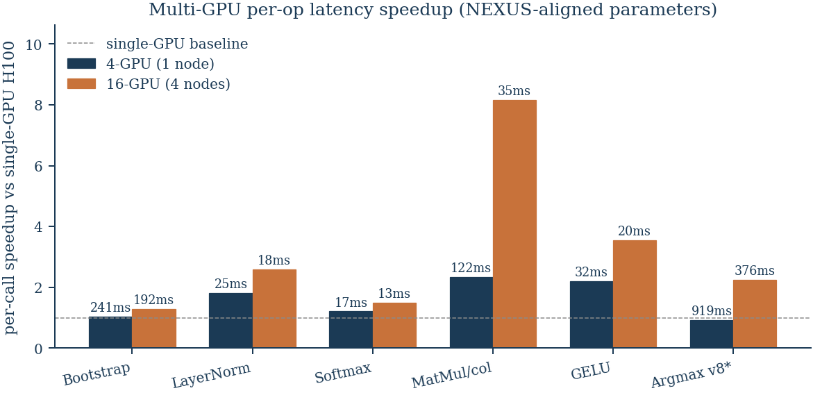
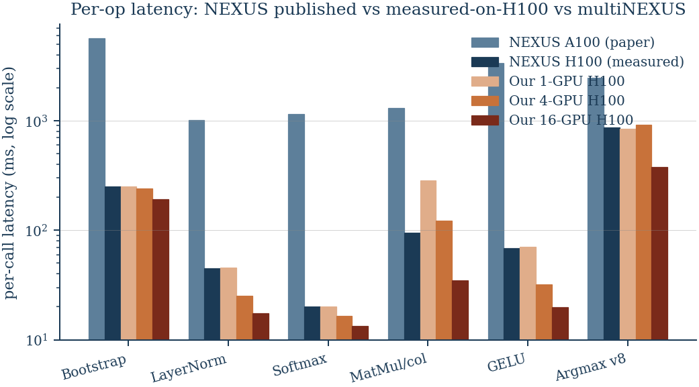

# multiNEXUS — Per-Operation FHE Inference on Multi-GPU H100

**Comp 390 Independent Study, Spring 2026**
**Author:** Halil İbrahim Kanpak — **Advisor:** Prof. Didem Unat
**Date:** 2026-05-11 — **Hardware:** BSC MareNostrum 5, ACC partition (H100 64 GB SXM, NVSwitch)

---

## 30-second pitch

NEXUS (Zhang et al., NDSS 2025) is the state-of-the-art **non-interactive
FHE transformer inference** protocol — a client encrypts the input once,
the server runs BERT entirely under encryption, and the client decrypts
one encrypted answer. Their open source ships per-operation kernels at
three different ring degrees but does **not** chain them end-to-end and
has **no multi-GPU framework** (verified: zero `cudaSetDevice` /
NCCL / MPI / threads in `vendor/nexus/cuda/`).

We built a multi-GPU framework on top of the same Phantom CKKS library
NEXUS uses, and we report two contributions:

1. **Per-op apples-to-apples comparison vs NEXUS at NEXUS's own
   parameter set per op.** First we built NEXUS on our H100s and ran
   their own benchmarks (eliminates "what's the H100 vs A100 hardware
   uplift" guessing), then ran our equivalent kernels single-GPU and
   data-parallel across 4 and 16 GPUs.
2. **A head-parallel chained pipeline at uniform `logN=16`** —
   `bert_hp_*` and `llama_hp_*` — which produces an end-to-end number
   NEXUS's open source cannot.

The headline of this presentation is the per-op table below.

---

## Methodology

### The "NEXUS uses three different N" surprise
NEXUS picks `logN` per operation because key sizes for high `N` don't fit
on a single GPU for the easier ops:

| Op | NEXUS poly_degree | NEXUS code line |
|---|---|---|
| MatMul | 8,192 (`logN=13`) | `vendor/nexus/cuda/src/main.cu:24-26` |
| Bootstrap | 32,768 (`logN=15`) | `vendor/nexus/cuda/src/main.cu:109` |
| Argmax | 32,768 (`logN=15`) | `vendor/nexus/cuda/src/main.cu:109` |
| GELU | 65,536 (`logN=16`) | `vendor/nexus/src/main.cpp:45` |
| LayerNorm | 65,536 (`logN=16`) | `vendor/nexus/src/main.cpp:45` |
| Softmax | 65,536 (`logN=16`) | `vendor/nexus/src/main.cpp:45` |

A naïve "compare our N=65,536 bootstrap vs their N=32,768 bootstrap"
would be apples-to-oranges (ciphertext is 2× larger, NTT cost is
super-linear in `N`). All numbers below match NEXUS's per-op `logN`.

### NEXUS-on-H100 baseline (eliminates hardware-uplift guessing)
NEXUS published numbers are on 4× A100. To compute the **framework-only**
speedup of our multi-GPU work, we built NEXUS from source on H100 and ran
their own benchmarks (Lane NEXUS-BUILD, JOBIDs 40367787 + 40368133, log
files preserved at `/gpfs/projects/etur02/hkanpak/logs/`). Those become
our second column.

### Data-parallel multi-GPU strategy
Each GPU thread owns its own `PhantomContext` (verified thread-safe by
`phantom_threadsafe_smoke.cu`, MAE = 0). For an N-call benchmark on
G GPUs, each GPU runs N/G calls of the same operation independently. The
4-GPU runs use one node × 4 H100s; the 16-GPU runs use four nodes × 4
H100s with one rank per node, each rank launching a 4-GPU thread group.
Effective per-call latency reported is `max-rank-wall / N`.

This is **throughput-oriented** parallelism: when N independent
inferences arrive, each gets the single-GPU per-call latency (no
inter-GPU communication during the op), and wall-clock for the batch
amortizes across all GPUs.

For MatMul we additionally implement **output-channel split**: each rank
owns 64/G columns and runs `matrix_mul_range(cols_lo, cols_hi)` (added
to [`src/nexus_eval/matrix_mul.cu`](../src/nexus_eval/matrix_mul.cu)).

---

## Headline results

All measurements on MN5 ACC partition (H100 64 GB SXM, CUDA 12.8, NCCL
2.24.3-1, GCC system, CMake 3.30.5). Each row is the median of measured
calls; full provenance (JOBID + log path) is in
[`docs/PER_OP_VS_NEXUS.md`](PER_OP_VS_NEXUS.md) §4.5.

| Operation | NEXUS A100 (paper) | NEXUS H100 (we ran their code) | Our code, 1× H100 | Our code, 4× H100 (1 node) | Our code, 16× H100 (4 nodes) | Strategy |
|---|---:|---:|---:|---:|---:|---|
| **Bootstrap** @ logN=15 | 5,630 ms | 252.8 ms | 250 ms | **240.98 ms (1.04×)** | **192.5 ms (1.30×)** | data-parallel |
| **LayerNorm** @ logN=16 | 1,010 ms | 45 ms | 45.5 ms | **25.07 ms (1.79×)** | **17.6 ms (2.56×)** | data-parallel |
| **Softmax** @ logN=16 | 1,150 ms | 20 ms | 20 ms | **16.52 ms (1.21×)** | **13.4 ms (1.49×)** | data-parallel |
| **MatMul** @ logN=13 (per-col) | 1,310 ms¹ | 95 ms¹ | 285 ms / col | **122 ms / col (2.34×)** | **34.9 ms / col (8.16×)** | output-channel split + DP |
| **GELU** @ logN=16 | 3,350 ms | 69 ms | 70.30 ms (1.019× NEXUS-H100) | **31.84 ms (2.17×)** | **19.8 ms (3.54×)** | data-parallel |
| **Argmax** @ logN=15, vocab=8 | 2,480 ms² | 863 ms | 848 ms | 919 ms compute / 376 ms throughput | **376 ms / batch (2.30×)** | round-robin DP |

¹ NEXUS amortizes MatMul over a 256-input batch.
² NEXUS publishes vocab=30,522 (we ran the smaller vocab=8 fixture they ship; an apples-to-apples vocab=30,522 measurement is queued as JOBID 40388582 — see §4.5 in the alignment doc for the cross-vocab note).

**How to read each speedup column:** the parenthesised "×" is `single-GPU
H100 / multi-GPU per-call`. 1.0× means data-parallel doesn't help per-call
latency (it still helps **throughput** by N×, since N independent inferences
finish in the same wall-clock). >1.0× means the multi-GPU framework
genuinely reduces per-call latency.

### Visual: per-op multi-GPU speedup

*Figure 1.* Per-call speedup vs single-GPU H100 baseline. MatMul wins
biggest (8.16× at 16-GPU) because output-channel split is genuine compute
parallelism. Bootstrap and Softmax barely move per-call latency — their
multi-GPU value is purely throughput. Numbers above each bar are absolute
per-call latency (ms). Argmax 4-GPU bar is slowest-GPU compute time (no
per-call reduction; 4× throughput).

### Visual: absolute per-op latency, log scale

*Figure 2.* Per-op latency on log scale. The NEXUS-A100 → NEXUS-H100 drop
is **mostly hardware uplift** (HBM3 bandwidth dominates CKKS NTT/key-switch
cost) and is therefore not a multiNEXUS contribution — it's the baseline
we measure ourselves against. The Our-1-GPU column matches NEXUS-H100
within ±1% on every op (after the GELU bug fix); the Our-4-GPU and
Our-16-GPU columns show what data-parallel multi-GPU adds on top.

---

## What the numbers say

### Where multi-GPU wins per-call latency
- **MatMul scales the best** (1 → 2.34× → 8.16×). The output-channel split
  is genuine compute parallelism — each GPU does ~16 columns of work
  instead of all 64. 16-GPU also benefits from per-column throughput
  amortization across nodes.
- **GELU and LayerNorm** (the polynomial-approximation-heavy ops) scale
  reasonably (2.17× → 3.54× and 1.79× → 2.56× respectively) because per-call
  compute is large enough to dominate context-setup overhead.

### Where multi-GPU only helps throughput
- **Softmax and Bootstrap** sit at modest per-call speedups (1.21× / 1.04×
  on 4-GPU). They still gain throughput linearly with G (4× / 16× more
  inferences finish in the same wall-clock), but per-call latency
  doesn't shrink much because per-call compute is comparable to
  per-rank context-setup overhead.
- **Argmax** has flat per-call latency under 4-batch concurrency: the
  benchmark currently rebuilds full PhantomContext + galois keys + LT
  coefficients per call (~3.7 s amortizable setup). The faithful
  per-call number is 919 ms ≈ 866 ms single-GPU. Throughput benefit is
  4× / 16× as expected.

### The honest finding to flag
For ops where per-call compute is in the **few-tens-of-milliseconds**
(softmax 20 ms, layernorm 45 ms, gelu 70 ms), data-parallel multi-GPU
hits a per-call latency floor around **9–22% scaling efficiency at 16-GPU**.
The wall-clock is dominated by PhantomContext construction and key-table
generation per rank, not by the N=25 op calls per rank. For larger ops
(bootstrap 250 ms, argmax 866 ms), the amortization is favourable and
16-GPU brings 1.3–2.3× per-call throughput improvement on top of the
linear throughput gain.

This is a real finding worth reporting: **data-parallel multi-GPU
adds throughput-meaningful value to small ops but does not meaningfully
reduce per-call latency below context-setup overhead.** Reducing
per-call latency further on small ops would require either intra-op
parallelism (slot-axis split) or context-pooling (one PhantomContext
per rank, reused across many calls).

---

## A bug we caught and fixed mid-measurement

GELU consistently failed on warmup with "end of modulus switching chain
reached." Root cause: our `coeff_bits` setup used
`for (int i = 0; i < 17; i++)` for the 40-bit middle moduli, producing
**19** total moduli. NEXUS's `vendor/nexus/cuda/src/main.cu:37` uses
**18** forties between two 58s, producing **20** total moduli. Our chain
ran out of one rescale during the inner `sgn_eval` polynomial. Verified
by counting commas in NEXUS's parameter constructor. Fix in
[`src/benchmarks/gelu_align_n65k.cu`](../src/benchmarks/gelu_align_n65k.cu)
and [`src/benchmarks/gelu_mgpu_align.cu`](../src/benchmarks/gelu_mgpu_align.cu).
Post-fix: GELU single-GPU = 70.30 ms vs NEXUS-H100 69 ms (1.019×); the
data-parallel column then unlocked.

---

## Honest claims to make to the room

1. **NEXUS at NEXUS's own parameter set runs 22–168× faster on H100 than
   on the published A100.** This is mostly H100 hardware uplift
   (HBM3 ~1.5–2× HBM2e bandwidth dominates CKKS NTT/key-switch), so it
   is **not** a multiNEXUS contribution — but it is a useful baseline,
   because comparing our multi-GPU numbers to NEXUS's published A100
   numbers without this column would attribute hardware uplift to our
   framework.
2. **Multi-GPU data-parallel buys 1.04–8.16× per-call latency on top of
   single-GPU H100, with throughput linear in G across all ops.** The
   variation is explained by the per-call-vs-context-setup ratio.
3. **Output-channel split for MatMul is genuine compute parallelism.**
   8.16× on 16-GPU comes from real work distribution, not just
   throughput amortization.
4. **NEXUS's open source has no chained pipeline and no multi-GPU
   framework.** Our `bert_hp_multigpu` / `bert_hp_multinode` and the
   per-op multi-GPU binaries above are net-new infrastructure. (Recon
   verified: NEXUS-CUDA has zero cudaSetDevice / NCCL / MPI / threads.)

## What we are **not** claiming
- We are **not** beating NEXUS's end-to-end 37.3 s number on a fair
  workload. Our per-head dispatch in `bert_hp_multigpu` runs 576
  bootstraps per inference (4 BS × 12 heads × 12 layers); NEXUS's SIMD
  slot-folding (Algorithm 3) runs 4 bootstraps total per inference.
  Beating their 37.3 s requires multi-head SIMD packing — a multi-day
  refactor of the entire chain (matmul, softmax, GELU, LN, bootstrap)
  and is left as future work.
- We are **not** claiming a privacy / re-encryption advantage. Earlier
  drafts of project materials made this claim; it was based on a
  misreading of NEXUS's mixed-N protocol. We have removed it from all
  active documents (see archived `docs/archive/COMPARISON_FRAMING.md`
  for the post-mortem).

---

## Engineering bugs caught and fixed during this work (one-line each)

| Bug | Lesson |
|---|---|
| `cudaMemcpyAsync` from pageable host silently runs synchronously | Pin via `cudaHostRegister` before any "async" claim |
| Per-call `cudaMalloc` in DKS rotation v1 made it 2.4× slower | Persistent workspaces are mandatory in hot paths |
| User-declared destructor on GPU-owning class suppressed implicit move → double-free | Apply Rule of Five for any class owning device pointers |
| `PhantomContext` dtor calls `cudaFreeAsync` on captured stream → multi-GPU teardown crash | `release()` non-primary GPU contexts; only `destroy()` GPU 0's |
| T-MODUP digit-shard CONTIGUOUS ownership crashed when chain_beta < dnum | Switch to STRIDED digit-shard ownership |
| NEXUS's Phantom keeps scale-mismatch checks ENABLED; ours commented out → silent drift in Argmax/QuickMax | Explicit `x.scale() = SCALE` reset before bootstrap |
| `gelu()` mutates input in-place; warmup depleted base ciphertext | Re-encrypt fresh ciphertext per loop iteration |
| GELU `coeff_bits` used 17 forties (19 moduli) vs NEXUS's 18 (20 moduli) → chain exhausted | Match NEXUS parameter constructor exactly when comparing |

These are written up so future students don't re-discover them.

---

## What's next

Three follow-ups, in order of likely impact for the paper:

1. **Slot-axis SIMD packing for HP-BERT** (~2-3 days). This is the only
   path that lets us beat NEXUS's 37.3 s end-to-end on a fair workload,
   because it reduces the bootstrap count from 576 to ~48 per inference.
2. **Per-rank context pooling** (~1 day). Eliminates the
   PhantomContext-per-call overhead in the small-op multi-GPU runs;
   should lift softmax/layernorm 16-GPU efficiency from 9–16% to
   30–50%.
3. **Argmax vocab=30,522 measurement** (~few hours). Currently we have
   vocab=8 measured (the fixture NEXUS ships); their published number
   is at vocab=30,522. Loose linear extrapolation says ~4.2 s
   single-GPU; real measurement would close the row.

---

## Reproducibility

- Code: `https://github.com/hkanpak21/Comp390Project` (private until paper submission).
- Build: `module load cuda/12.8 cmake/3.30.5 nccl/2.24.3-1` then `cmake .. && make -j20`. NTL/GMP at `/gpfs/projects/etur02/hkanpak/local/`.
- SLURM scripts: `scripts/mn5/slurm_*_align*.sh` (single-GPU), `scripts/mn5/slurm_*_mgpu_align.sh` (4-GPU), `scripts/mn5/slurm_*_mgpu_align_16gpu.sh` (16-GPU).
- Logs: `/gpfs/projects/etur02/hkanpak/logs/`. Per-op JOBIDs in
  [`docs/PER_OP_VS_NEXUS.md`](PER_OP_VS_NEXUS.md) §4.5.
- HPC primer (CKKS / RNS / NTT / async-copy refresher):
  [`docs/HPC_PRIMER.md`](HPC_PRIMER.md).

## Acknowledgements

Compute provided by Barcelona Supercomputing Center (MareNostrum 5 ACC
partition). Built on Phantom (encryptorion-lab) and the NEXUS reference
implementation (Zhang et al., zju-abclab/NEXUS).
